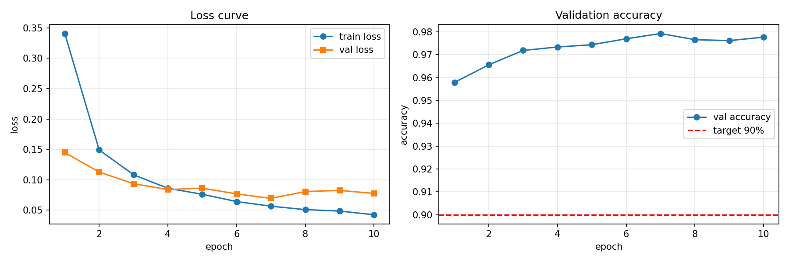

# Level 1：MLP 完成 MNIST 手写数字识别

<p align="center">
  
  
  
  
  
  
</p>

<p align="center">
  <b>2026 Dian 团队秋招算法题 · Level 1</b><br/>
  使用多层感知机（MLP）完成 MNIST 手写数字分类
</p>

---

## 项目简介

从神经网络基础出发，本 Level 完成：

1. 理解 MLP 的**前向传播 → 计算损失 → 反向传播 → 参数更新**完整流程
2. 掌握 PyTorch 基本训练流程：`Tensor` / `Dataset` / `DataLoader` / 自动求导 / `nn.Module` / 优化器
3. 将 MNIST 图片展平后输入 MLP，训练手写数字分类模型
4. 完成训练、评估、推理脚本，并保存 Loss 曲线


---

## 文件架构

```
level1/
├── dataset.py      # 数据层：MNIST 下载、预处理、数据集划分
├── model.py        # 模型层：MLP 网络结构定义、参数量统计
├── train.py        # 训练层：训练循环、验证评估、Loss 曲线绘制
├── evaluate.py     # 评估层：测试集准确率验收（≥90%）
├── inference.py    # 推理层：单张图片预测脚本
├── data/           # MNIST 数据集（.gitignore 忽略，自动下载）
├── run/            # 训练产物：loss_curve.png、best.pt、final.pt
│   └── loss_curve.png
└── README.md       # 本文档
```

### 各文件职责

| 文件           | 主要函数 / 类                                              |
| :------------- | :--------------------------------------------------------- |
| `dataset.py`   | `build_transform()` `get_dataloaders()`                    |
| `model.py`     | `MLP` `count_parameters()`                                 |
| `train.py`     | `train_one_epoch()` `train()` `evaluate()` `plot_curves()` |
| `evaluate.py`  | `evaluate_test()`                                          |
| `inference.py` | `predict()`                                                |


---

## 网络结构

|  层   | 类型         |      输入      |   输出   | 激活函数 |
| :---: | :----------- | :------------: | :------: | :------: |
|   0   | `nn.Flatten` | (B, 1, 28, 28) | (B, 784) |    —     |
|   1   | `Linear`     |      784       |   256    |   ReLU   |
|   2   | `Linear`     |      256       |   128    |   ReLU   |
|   3   | `Linear`     |      128       |    10    |    —     |

- **可学习参数量：235,146**


---

##  超参数选择

| 超参数          |       取值        |
| :-------------- | :---------------: |
| `BATCH_SIZE`    |        128        |
| `EPOCHS`        |        10         |
| `LEARNING_RATE` |       1e-3        |
| `HIDDEN_DIMS`   |    (256, 128)     |
| `DROPOUT`       |        0.2        |
| `optimizer`     |       Adam        |
| `loss`          | CrossEntropyLoss  |
| 标准化          | μ=0.1307 σ=0.3081 |
| `VAL_RATIO`     |        1/6        |
| 设备            |   CUDA（vGPU）    |

---

## 实验结果

### Loss 与准确率曲线

<p align="center">
  
</p>

### 结果汇总

| 指标                            |    数值     |
| :------------------------------ | :---------: |
| 训练集 Loss（第 10 epoch）      |   ≈ 0.05    |
| 验证集 Loss（第 10 epoch）      |   ≈ 0.09    |
| 验证集准确率（第 1 epoch）      |   ≈ 95.8%   |
| **验证集准确率（第 10 epoch）** | **≈ 97.8%** |
| **测试集准确率**                | **97.77%**  |


---

##  快速开始

```bash
# 1. 进入目录并激活环境
cd level1
conda activate d2l        # 本地环境名, 服务器按镜像环境

# 2. 训练(首次自动下载 MNIST 到 data/)
python train.py
# 产物: run/loss_curve.png, run/best.pt, run/final.pt

# 3. 测试集评估(验收: >= 90%)
python evaluate.py
```

---
