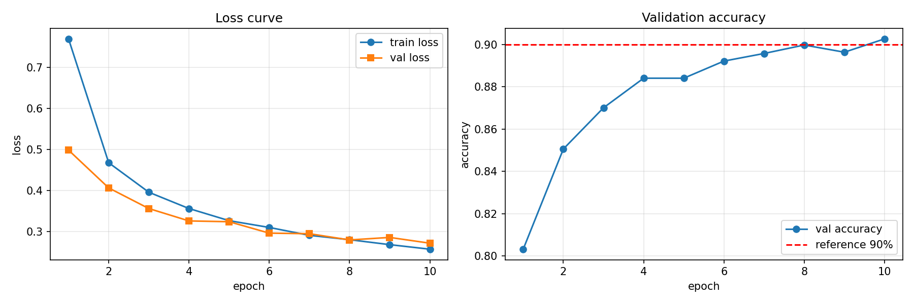
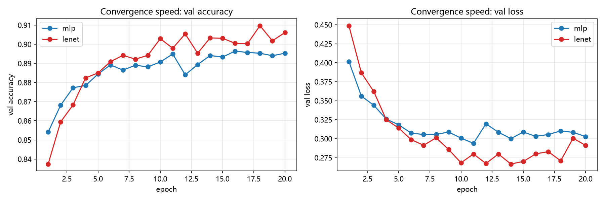
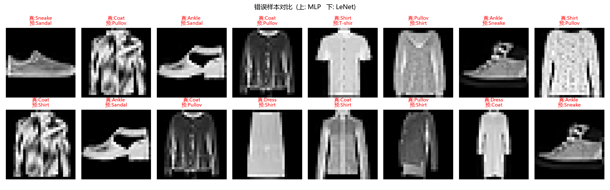

# Level 2：CNN 完成 Fashion-MNIST，并与 MLP 对比

<p align="center">
  
  
  
  
  
  
</p>

<p align="center">
  <b>2026 Dian 团队秋招算法题 · Level 2</b><br/>
  使用 LeNet-5（CNN）完成 Fashion-MNIST 分类，并与 MLP 做四角度对比
</p>

---

## 项目简介

在 Level 1 的 MLP 基础上，本 Level 完成：

1. 理解卷积神经网络处理图像的方式：**局部感受野、权重共享、平移不变性**
2. 理解 CNN 相对 MLP 的约束与优势：相邻像素具有相关性，卷积天然利用了这一先验
3. 复用 Level 1 的数据与训练流程，训练 LeNet-5 版本的分类器
4. 从**准确率、参数量、收敛速度、错误样本**四个角度与 MLP 对比


---

## 文件架构

```
level2/
├── dataset.py        # 数据层：Fashion-MNIST 下载、预处理、数据集划分
├── model.py          # 模型层：LeNet-5 网络结构定义、参数量统计
├── train.py          # 训练层：训练循环、验证评估、Loss 曲线绘制
├── evaluate.py       # 评估层：测试集验收 + 各类别准确率
├── compare(AI).py    # 对比层：MLP vs CNN 四角度对照实验
├── data/             # Fashion-MNIST 数据集（.gitignore 忽略，自动下载）
├── run/              # 训练产物：曲线图、权重、训练历史
│   ├── loss_curve.png                # CNN 训练曲线（验收要求）
│   ├── compare_convergence.png       # MLP vs CNN 收敛速度对比
│   ├── compare_errors.png            # 错误样本对比
│   ├── best.pt / final.pt            # LeNet 权重
│   └── *_history.json                # 训练历史（供对比复用）
└── README.md         # 本文档
```

### 各文件职责

| 文件             | 主要函数 / 类                                                                       | 职责说明                                                                                |
| :--------------- | :---------------------------------------------------------------------------------- | :-------------------------------------------------------------------------------------- |
| `dataset.py`     | `build_transform()` `get_dataloaders()`                                             | 下载 Fashion-MNIST；`ToTensor` + `Normalize(0.2860, 0.3530)`；从训练集划出 1/6 作验证集 |
| `model.py`       | `LeNet` `count_parameters()`                                                        | LeNet-5 结构（两层卷积 + 池化 + 三层全连接）；统计可学习参数量                          |
| `train.py`       | `train_one_epoch()` `train()` `evaluate()` `plot_curves()`                          | 训练循环、验证评估、绘制并保存 Loss 曲线、保存权重与训练历史（`history.json`）          |
| `evaluate.py`    | `evaluate_test()` `per_class_accuracy()`                                            | 加载 `run/best.pt`，测试集准确率验收（≥90%），并输出每类准确率定位模型弱点              |
| `compare(AI).py` | `MLP`(内联) `train_model()` `collect_errors()` `plot_convergence()` `plot_errors()` | 复用同一份数据划分，分别训练 MLP 与 LeNet，输出四角度对比图表                           |

### 数据流动


---

## 网络结构

### LeNet-5（本 Level 的 CNN）

|  层   | 类型        |      输入       |      输出       | 激活函数 | 说明                                  |
| :---: | :---------- | :-------------: | :-------------: | :------: | :------------------------------------ |
|   0   | `Conv2d`    | (B, 1, 28, 28)  | (B, 6, 28, 28)  |   ReLU   | 6 个 5×5 卷积核，`padding=2` 保持尺寸 |
|   1   | `MaxPool2d` | (B, 6, 28, 28)  | (B, 6, 14, 14)  |    —     | 2×2 下采样                            |
|   2   | `Conv2d`    | (B, 6, 14, 14)  | (B, 16, 10, 10) |   ReLU   | 16 个 5×5 卷积核                      |
|   3   | `MaxPool2d` | (B, 16, 10, 10) |  (B, 16, 5, 5)  |    —     | 2×2 下采样                            |
|   4   | `Flatten`   |  (B, 16, 5, 5)  |    (B, 400)     |    —     | 展平为 16×5×5=400                     |
|   5   | `Linear`    |       400       |       120       |   ReLU   | 全连接，后接 `Dropout(0.2)`           |
|   6   | `Linear`    |       120       |       84        |   ReLU   | 全连接，后接 `Dropout(0.2)`           |
|   7   | `Linear`    |       84        |       10        |    —     | 输出 10 类 logits（不接 softmax）     |

- **可学习参数量：61,706**
- 在原始 LeNet-5 上的现代微调：`ReLU` 替代 Tanh、`MaxPool` 替代 AvgPool
- 输出层不加激活函数：`CrossEntropyLoss` 内部自带 softmax，数值更稳定

### 对照实验中的 MLP

与 Level 1 完全相同的结构（内联在 `compare(AI).py` 中）：`784 → 256 → 128 → 10`，`Dropout(0.2)`，可学习参数量 **235,146**。

---

##  超参数选择

| 超参数          |       取值        |
| :-------------- | :---------------: |
| `BATCH_SIZE`    |        128        |
| `EPOCHS`        |        20         |
| `LEARNING_RATE` |       1e-3        |
| `DROPOUT`       |        0.2        |
| `optimizer`     |       Adam        |
| `loss`          | CrossEntropyLoss  |
| 标准化          | μ=0.2860 σ=0.3530 |
| `VAL_RATIO`     |        1/6        |
| 设备            | RTX 5070（本机）  |

> 对比实验中 MLP 与 CNN 使用**完全相同的**优化器、学习率、epochs、batch size，
> 且共用同一次 `get_dataloaders()` 的数据划分，保证公平。

---

## 实验结果

### CNN 训练曲线

<p align="center">
  
</p>

### 单模型结果汇总（LeNet-5）

| 指标                       |          数值          |
| :------------------------- | :--------------------: |
| 训练集 Loss（第 20 epoch） |         ≈ 0.18         |
| 验证集 Loss（第 20 epoch） |         ≈ 0.26         |
| 首次破 90%                 |        epoch 11        |
| **验证集准确率（最佳）**   | **91.38%**（epoch 17） |
| **测试集准确率**           |       **90.53%**       |

> [思考]
> 首 epoch 验证准确率即达 82.6%，前 8 个 epoch 涨到 89.7%，之后进入平台期——
> 固定学习率下模型在最优解附近振荡，说明继续加 epoch 边际收益低，改用学习率衰减更有效。

### 四角度对比（MLP vs CNN）

<p align="center">
  
  
</p>

| 角度     | MLP                                           | LeNet (CNN)                   | 结论                           |
| :------- | :-------------------------------------------- | :---------------------------- | :----------------------------- |
| 准确率   | 验证 89.64% / 测试 88.94%                     | 验证 90.97% / **测试 89.69%** | CNN 高约 +0.8~1.0 个百分点     |
| 参数量   | 235,146                                       | **61,706（仅 1/4）**          | 更少参数、更高准确率           |
| 收敛速度 | 最高 89.64%，**全程未破 90%**                 | epoch 10 破 90%，最终 90.97%  | CNN 能突破 90% 瓶颈            |
| 错误样本 | Coat/Pullover/Shirt/Dress 互混 + 少量鞋类混淆 | 同样集中在服装类互混          | 错误模式相似，均为纹理相近类别 |

**为什么 CNN 更适合图像任务？**

1. **局部感受野 + 相邻像素相关性**：图像中相邻像素高度相关，卷积核在局部窗口内提取
   边缘、纹理等模式，直接利用了图像的空间先验；MLP 展平后丢弃了空间结构。
2. **权重共享**：同一个卷积核在整张图上滑动，参数量大幅下降（仅 MLP 的 1/4），
   同时学到的特征具有平移不变性——衣服出现在图片哪个位置都能被识别。
3. **更少的参数带来更好的泛化**：MLP 参数量大 4 倍，反而在验证集上更早进入平台期。

### 各类别准确率（LeNet-5，测试集）

```
T-shirt/top  87.3%    Trouser   97.6%    Pullover  85.6%    Dress   91.8%    Coat    84.1%
Sandal       98.4%    Shirt     69.8%    Sneaker   96.0%    Bag     98.0%    Ankle boot 96.7%
```

- 鞋类（Sandal/Sneaker/Bag/Ankle boot）普遍 96%+，鞋形轮廓特征明显
- `Shirt`（69.8%）最弱：与 T-shirt/top、Pullover、Coat 外形纹理高度相似，是 Fashion-MNIST 公认的难点


## 🚀 快速开始

```bash
# 1. 进入目录并激活环境（本机 5070，Python 3.11 + PyTorch 2.11 cu128）
cd level2
conda activate dian

# 2. 训练（首次自动下载 Fashion-MNIST 到 data/）
python train.py
# 产物: run/loss_curve.png, run/best.pt, run/final.pt, run/history.json

# 3. 测试集验收（>= 90%）
python evaluate.py

# 4. 四角度对比实验（MLP vs CNN，各 20 epoch）
python "compare(AI).py"
# 产物: run/compare_convergence.png, run/compare_errors.png
```

---

*Author: johnmayer123-bluser · 2026 Dian 团队秋招*
