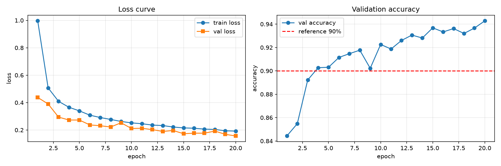

# Level 3：经典网络 AlexNet（Fashion-MNIST）

<p align="center">
  
  
  
  
  
</p>

<p align="center">
  <b>2026 Dian 团队秋招算法题 · Level 3（AlexNet 部分）</b><br/>
  实现经典网络 AlexNet，掌握深层 CNN 的三大技术：ReLU、Dropout、数据增强
</p>

---

## 项目简介

在 Level 1/2 的基础上，本 Level 完成：

1. 实现经典网络 **AlexNet**（5 层卷积 + 3 层全连接），在 Fashion-MNIST 上训练
2. 掌握 AlexNet 的三大贡献：**ReLU**（缓解梯度消失）、**Dropout(0.5)**（抑制过拟合）、**数据增强**（随机裁剪 + 水平翻转）


---

## 文件架构

```
level3_alexnet/
├── dataset.py        # 数据层：Fashion-MNIST、224×224 Resize、数据增强、数据集划分
├── model.py          # 模型层：AlexNet 结构定义、Kaiming 初始化、参数量统计
├── train.py          # 训练层：SGD 训练循环、梯度裁剪、Loss 曲线绘制
├── evaluate.py       # 评估层：测试集验收 + 各类别准确率
├── data/             # Fashion-MNIST 数据集（.gitignore 忽略，自动下载）
├── run/              # 训练产物
│   ├── loss_curve.png                # 训练曲线
│   └── history.json                  # 逐 epoch 训练历史
└── README.md         # 本文档
```

### 各文件职责

| 文件          | 主要函数 / 类                                              | 职责说明                                                                            |
| :------------ | :--------------------------------------------------------- | :---------------------------------------------------------------------------------- |
| `dataset.py`  | `build_transform()` `get_dataloaders()`                    | 下载 Fashion-MNIST；训练集 Resize(224)+随机裁剪+水平翻转，验证/测试集只做基础预处理 |
| `model.py`    | `AlexNet` `count_parameters()`                             | AlexNet 结构（5 卷积 + 3 全连接）；Kaiming(fan_out) 初始化；统计参数量              |
| `train.py`    | `train_one_epoch()` `train()` `evaluate()` `plot_curves()` | SGD 训练循环（含梯度裁剪）、验证评估、绘制 Loss 曲线、保存权重与历史                |
| `evaluate.py` | `evaluate_test()` `per_class_accuracy()`                   | 加载 `run/best.pt` 在测试集上验收，输出每类准确率                                   |


---

## 网络结构

### AlexNet（本实现为变体）

|  层   | 类型                 |       输入        |       输出        | 激活  |
| :---: | :------------------- | :---------------: | :---------------: | :---: |
|   0   | `Conv2d` 1→64, 11×11 | (B, 1, 224, 224)  | (B, 64, 109, 109) | ReLU  |
|   1   | `MaxPool2d` 3×3      | (B, 64, 109, 109) |  (B, 64, 54, 54)  |   —   |
|   2   | `Conv2d` 64→192, 3×3 |  (B, 64, 54, 54)  | (B, 192, 56, 56)  | ReLU  |
|   3   | `MaxPool2d` 3×3      | (B, 192, 56, 56)  | (B, 192, 27, 27)  |   —   |
|  4-6  | `Conv2d` ×3, 3×3     | (B, 192, 27, 27)  | (B, 256, 27, 27)  | ReLU  |
|   7   | `MaxPool2d` 3×3      | (B, 256, 27, 27)  | (B, 256, 13, 13)  |   —   |
|   8   | `AdaptiveAvgPool2d`  | (B, 256, 13, 13)  |  (B, 256, 6, 6)   |   —   |
|   9   | `Flatten`            |  (B, 256, 6, 6)   |     (B, 9216)     |   —   |
|  10   | `Linear` 9216→4096   |     (B, 9216)     |     (B, 4096)     | ReLU  |
|  11   | `Linear` 4096→4096   |     (B, 4096)     |     (B, 4096)     | ReLU  |
|  12   | `Linear` 4096→10     |     (B, 4096)     |      (B, 10)      |   —   |

- **可学习参数量：56,832,714**（其中约 5400 万集中在两个 4096 全连接层）

---

##  超参数选择

| 超参数          |                          取值                          |
| :-------------- | :----------------------------------------------------: |
| `BATCH_SIZE`    |                          128                           |
| `EPOCHS`        |                           20                           |
| `LEARNING_RATE` |             0.01            |
| `optimizer`     |          SGD(momentum=0.9, weight_decay=5e-4)          |
| `loss`          |                    CrossEntropyLoss                    |
| `DROPOUT`       |                          0.5                           |
| 初始化          |                 Kaiming               |
| 梯度裁剪        |                  clip_grad_norm_(5.0)                  |
| 数据增强        | Resize(224) + RandomCrop(pad=4) + RandomHorizontalFlip |
| 标准化          |                   μ=0.2860 σ=0.3530                    |
| 设备            |                   RTX 4090（服务器）                   |

---

## 实验结果

### Loss 与准确率曲线

<p align="center">
  
</p>


## 训练过程遇到的问题
在本次实验中，第一次实验从epoch=7时就出现了train_loss=NAN的情况，初步怀疑是梯度爆炸了。于是开始查询有哪些能够防止梯度爆炸的方法：第一点是，暑假期间在d2l上看到采取sigmoid函数做activate function时可以使用Xavier初始化来抑制梯度爆炸和梯度消失，而如今activate function主要用relu函数（个人理解：relu函数在输入大于0时梯度恒为1，相比sigmoid函数在x较大时梯度很小，可以防止参数更新步长太短和梯度消失）。进一步查询资料发现，kaiming norm可以用作relu做激活函数的参数初始化方法。第二点是，可以采用gradient clip方法，来截断梯度值，防止梯度爆炸。最后也是成功解决了训练时梯度爆炸的问题。
此外，训练只有20epochs，图像说明还没收敛，可以增加epoch数后续。

---


## 快速开始

```bash
# 本地（dian 环境，RTX 5070）或服务器（镜像环境，RTX 4090）
cd level3_alexnet
conda activate dian            # 本地；服务器按镜像环境

# 训练（首次自动下载 Fashion-MNIST）
python train.py
# 产物: run/loss_curve.png, run/best.pt, run/final.pt, run/history.json

# 测试集验收
python evaluate.py

```
